# Enhanced Metadata Caching V2 - Dependency Graph

## Component Dependency Analysis

This document provides a comprehensive dependency graph for the Enhanced Metadata Caching V2 system, showing the relationships between all components.

## Visual Dependency Graph

```mermaid
graph TD
    %% External Dependencies
    MODELS[("📊 models.py<br/>Data Models")]
    EXCEPTIONS[("⚠️ exceptions.py<br/>Error Types")]
    SQLITE[("🗄️ aiosqlite<br/>Database")]
    PATHLIB[("📁 pathlib<br/>File System")]
    
    %% Core V2 Components
    DB[("🗄️ database_v2.py<br/>Database Schema<br/>543 lines")]
    VD[("🔍 version_detector.py<br/>Module Detection<br/>367 lines")]
    GVM[("🌐 global_version_manager.py<br/>Version Management<br/>568 lines")]
    CACHE[("📦 cache_v2.py<br/>Intelligent Cache<br/>644 lines")]
    SYNC[("🔄 sync_manager_v2.py<br/>Smart Sync<br/>601 lines")]
    INIT[("📘 __init__.py<br/>Public API<br/>49 lines")]
    
    %% External System Dependencies
    CLIENT[("🌍 FOClient<br/>D365 F&O API")]
    API_OPS[("🔧 MetadataAPIOperations<br/>API Interface")]
    
    %% Dependency Relationships
    
    %% Foundation Layer
    DB --> SQLITE
    DB --> PATHLIB
    
    %% Version Detection Layer
    VD --> MODELS
    VD --> EXCEPTIONS
    VD --> API_OPS
    
    %% Version Management Layer
    GVM --> MODELS
    GVM --> SQLITE
    GVM --> PATHLIB
    
    %% Cache Layer (Central Hub)
    CACHE --> DB
    CACHE --> GVM
    CACHE --> VD
    CACHE --> MODELS
    CACHE --> SQLITE
    CACHE --> PATHLIB
    
    %% Sync Layer
    SYNC --> CACHE
    SYNC --> GVM
    SYNC --> MODELS
    SYNC --> CLIENT
    
    %% API Layer
    INIT --> DB
    INIT --> VD
    INIT --> GVM
    INIT --> CACHE
    INIT --> SYNC
    
    %% External Integration
    CLIENT --> API_OPS
    
    %% Styling
    classDef coreComponent fill:#e1f5fe,stroke:#01579b,stroke-width:2px
    classDef externalDep fill:#f3e5f5,stroke:#4a148c,stroke-width:2px
    classDef dataModel fill:#e8f5e8,stroke:#1b5e20,stroke-width:2px
    
    class DB,VD,GVM,CACHE,SYNC,INIT coreComponent
    class SQLITE,PATHLIB,CLIENT,API_OPS externalDep
    class MODELS,EXCEPTIONS dataModel
```



## Detailed Component Dependencies

### 1. 🗄️ Database Schema (database_v2.py)
**Dependencies**: 
- `aiosqlite` - SQLite database operations
- `pathlib` - File system path management

**Dependents**: 
- `cache_v2.py` - Uses MetadataDatabaseV2 for storage
- `global_version_manager.py` - Shares database path

**Role**: Foundation layer providing database schema and operations

---

### 2. 🔍 Version Detector (version_detector.py)
**Dependencies**:
- `../models` - ModuleVersionInfo, EnvironmentVersionInfo
- `../exceptions` - MetadataError
- `MetadataAPIOperations` - API interface for GetInstalledModules

**Dependents**:
- `cache_v2.py` - Uses for version detection
- External clients via __init__.py

**Role**: Version detection using D365 F&O GetInstalledModules action

---

### 3. 🌐 Global Version Manager (global_version_manager.py)
**Dependencies**:
- `../models` - Version and module information models
- `aiosqlite` - Direct database access
- `pathlib` - Database path management

**Dependents**:
- `cache_v2.py` - Uses for cross-environment sharing
- `sync_manager_v2.py` - Uses for version management
- External clients via __init__.py

**Role**: Cross-environment version registry and sharing

---

### 4. 📦 Intelligent Cache (cache_v2.py) - **CENTRAL HUB**
**Dependencies**:
- `database_v2.py` - Database operations
- `global_version_manager.py` - Version management
- `version_detector.py` - Version detection
- `../models` - All data models
- `aiosqlite` - Database access
- `pathlib` - File management

**Dependents**:
- `sync_manager_v2.py` - Uses cache for sync operations
- External clients via __init__.py

**Role**: Central coordination hub for all metadata operations

---

### 5. 🔄 Smart Sync Manager (sync_manager_v2.py)
**Dependencies**:
- `cache_v2.py` - Cache operations
- `global_version_manager.py` - Version management
- `../models` - Sync-related models
- `FOClient` - D365 F&O API access

**Dependents**:
- External clients via __init__.py

**Role**: Intelligent synchronization with progress tracking

---

### 6. 📘 Public API (__init__.py)
**Dependencies**:
- All internal components (imports only)

**Dependents**:
- External applications and demo scripts

**Role**: Public API surface and component exports

---

## Dependency Layers

### Layer 1: Foundation
- `database_v2.py` - Database schema and operations
- `models.py` - Data structures
- `exceptions.py` - Error handling

### Layer 2: Core Services  
- `version_detector.py` - Version detection services
- `global_version_manager.py` - Version management services

### Layer 3: Integration Hub
- `cache_v2.py` - **Central coordination point**

### Layer 4: High-Level Operations
- `sync_manager_v2.py` - Sync orchestration

### Layer 5: Public Interface
- `__init__.py` - External API

## Critical Dependency Paths

### Version Detection Flow:
```
FOClient → version_detector.py → cache_v2.py → global_version_manager.py → database_v2.py
```

### Sync Operation Flow:
```
sync_manager_v2.py → cache_v2.py → global_version_manager.py → database_v2.py
                   ↘ FOClient (metadata APIs)
```

### Cross-Environment Sharing Flow:
```
cache_v2.py → global_version_manager.py → database_v2.py (global version registry)
```

## Dependency Characteristics

### 🎯 Central Hub Pattern
- **`cache_v2.py`** serves as the central coordination hub
- All high-level operations flow through the cache
- Encapsulates complexity from external users

### 🔄 Layered Architecture
- Clear separation between foundation, services, and coordination layers
- Dependencies flow upward through layers
- No circular dependencies

### 🌐 External Integration Points
- **`FOClient`** - D365 F&O API access
- **`MetadataAPIOperations`** - Metadata API operations
- **`aiosqlite`** - Database persistence
- **`pathlib`** - File system operations

### 📊 Shared Data Models
- All components share common data models from `models.py`
- Type-safe interfaces throughout
- Consistent error handling via `exceptions.py`

## Architecture Strengths

1. **Single Responsibility**: Each component has a focused purpose
2. **Clear Dependencies**: Explicit dependency relationships
3. **No Circular Dependencies**: Clean dependency tree
4. **Central Coordination**: Cache serves as intelligent hub
5. **External Isolation**: External dependencies are isolated
6. **Testability**: Each component can be tested independently

## Usage Pattern

```python
# Standard usage pattern follows dependency flow:

# 1. Initialize cache (coordinates all dependencies)
cache = MetadataCacheV2(cache_dir, base_url)
await cache.initialize()

# 2. Version detection (through cache)
sync_needed, version_id = await cache.check_version_and_sync(fo_client)

# 3. Sync operations (through sync manager using cache)
if sync_needed:
    sync_manager = SmartSyncManagerV2(cache)
    result = await sync_manager.sync_metadata(fo_client, version_id)

# 4. Data operations (through cache)
entities = await cache.get_data_entities(name_pattern="%customer%")
```

This dependency graph shows a well-architected system with clear separation of concerns, no circular dependencies, and a central coordination hub pattern that simplifies external usage while maintaining internal flexibility.